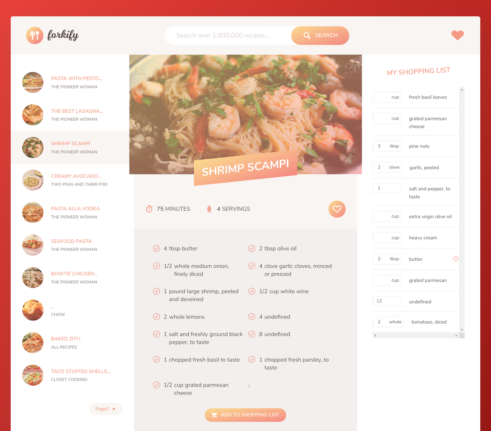

# FOOD RECIPES SEARCH APP   
A homework project that using all the JavaScript concepts learned in previous sections to create a Recipe Search App using JavaScript ES6 features, HTML, and CSS.

## Screenshots

## Run Test
[Click run](https://cnwebdev.github.io/RecipeApp/dist)

